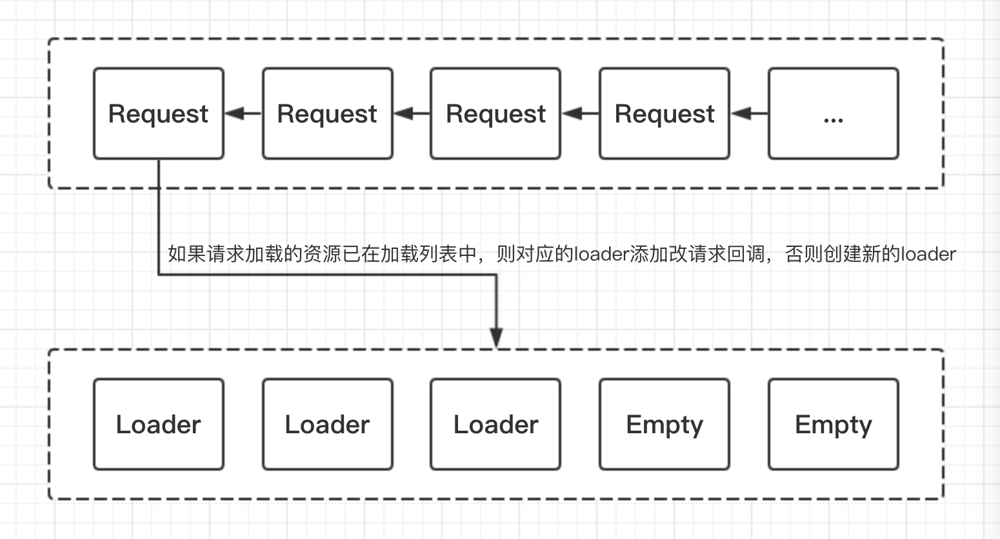

# 资源管理
* AssetBundle打包管理
* Resource管理
* 热更新

## Unity资源加载方式
* Resources：[官方不推荐](https://unity3d.com/cn/learn/tutorials/topics/best-practices/resources-folder)
* AssetBundle：[官方介绍](https://docs.unity3d.com/Manual/AssetBundlesIntro.html)
* AssetDataBase: 编辑模式下

### AssetBundle打包管理
* 一键打包：Tools->AssetBundle->Build
* 冗余情况：A依赖C，B依赖C，如果只打成A,B两个Bundle包，就会冗余C。每个资源文件单独打成一个Bundle包，简单方便，同时保证不冗余，但会造成Bundle数目过多
* 粒度问题：A依赖B、C、D，按单资源打成单Bundle包的策略会打成A，B，C，D四个Bundle，加载依赖是要加载4个包，但如果C，D是被A所唯一依赖的，那么更好的策略就是A，C，D打成一个Bundle包，那么加载依赖就只用加载2个Bundle包，提高了加载效率，同时也不会冗余资源
* 打包策略：保证不冗余的情况下，最大限度的减少粒度
    - 指定根目录，记录所有文件和其被依赖列表
    - 文件被依赖数大于1，就单独打成Bundle包，否则向上归并至被依赖项
* 图示示例：
~~~c#
    /* 向上归并依赖
     *      a        e                 
     *       \      /                    
     *        b    f     ==>  (a,b,c,h) -> (d) <- (e,f)
     *      / | \ /                          
     *     c  h  d      
     */
~~~
    
### Resource管理
* 同步加载
    - 编辑器模式下：UnityEditor.AssetDatabase.LoadAssetAtPath
    - AssetBundle同步加载：1.根据AssetBundleManifest，同步加载自身及所有依赖的AssetBundle(LoadFromFile) 2.根据加载出来的AssetBundle同步加载对应资源(LoadAsset)
* 异步加载
    - 编辑器模式下：还是使用同步加载(可以加点延时模拟)
    - AssetBundle异步加载：

### 热更新
* [构建本地服务器](../../Server/README.md)
    